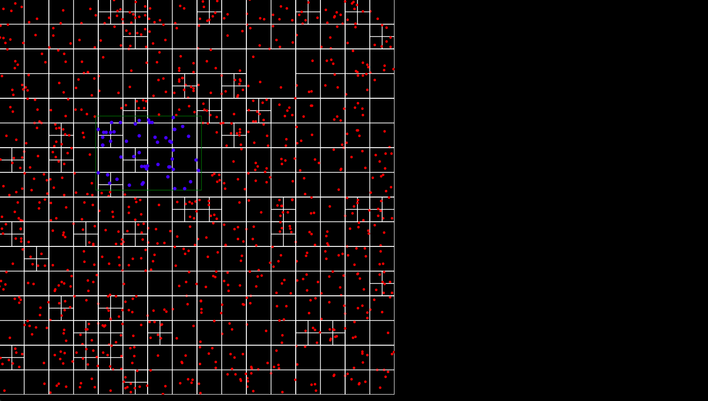
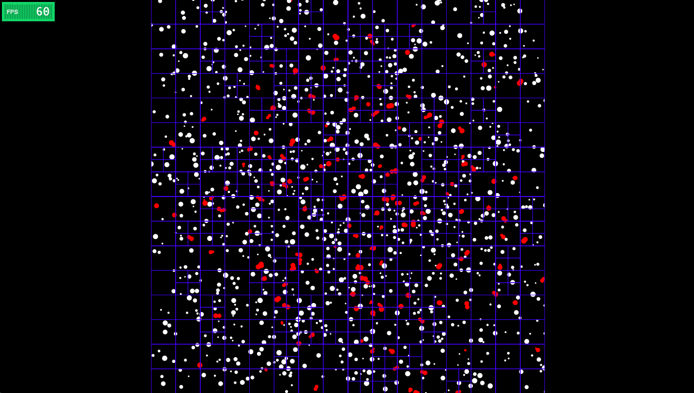
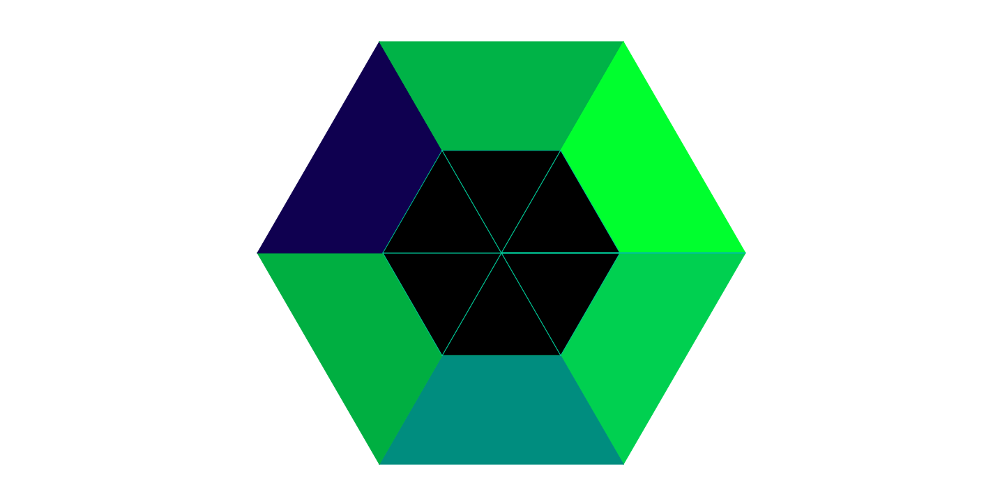
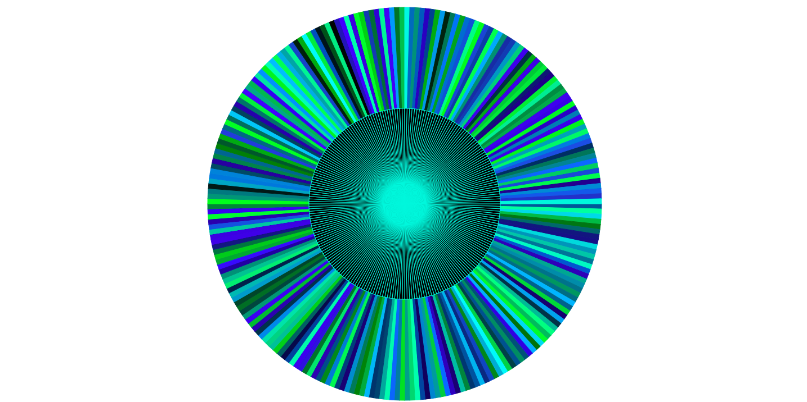

# Test Projects

This is an informational document about all the test projects contained in this folder. These were used as stepping stones towards a final larger project and should not be thought of as "finished" in any way. Feel free to look around or use anything you find. If I used things from somewhere else the links to the respective owners are found below.

## List of Test Projects:

* Quadtree_Static_Particles
* Quadtree_Moving_Particles
* Shape_Design_Triangles

These projects are only partially functional, but are hopefully somewhat helpful to understand the algorithms used in the game that is associated with this project.

## Project Descriptions:

### Quadtree_Static_Particles

This project was used to understand and create the Quadtree Algorithm. It has randomly generated static "points" throughout the canvas. A box will follow the mouse around and the quadtree is used to pull the points that are in the boxed region. They will be marked in blue. 

This project was created with the help of The Coding Train, his youtube channel can be found [HERE](https://www.youtube.com/user/shiffman). 

### Quadtree_Moving_Particles

This project used the prevous one with improvments and stress testing. The quadtree algoritm is used to determine collision detection between many circles all moving in random directions. As a part of the project you can enable and disable the quadtree to view performance differences. In code you can change the amound of particles, the particle sizes, and also give the particles a random size. This project uses the largest possible particle for the check region. There should be a better way to do this but that is what I came up with. You can also enable or disable the rendering of the quadtree itself.

This project was created with the help of The Coding Train, his youtube channel can be found [HERE](https://www.youtube.com/user/shiffman). 

This project also used a library for the FPS meter. I found this online and it looks really cool. You can find it [HERE](http://darsa.in/fpsmeter/).

### Shape_Design_Triangles

This project is not in any way done "correctly" however it was just a test case to work out the visuals for drawing and creating circle like shapes out of triangles using the line rendering tools that come with javascript canvas. You can change the amount of triangles that get displayed and mess with the colors. I chose a blue green mixture because it looked the most visually appealing. This is an idea that will hopefully lead to the design of the game character, or bacteriophages. If you want to know more about bacteriophages you can click [HERE](https://en.wikipedia.org/wiki/Bacteriophage). They have this triangle like visual on top when rendered in drawings. Lastly here are some pictures of the outcome. 

    
    

